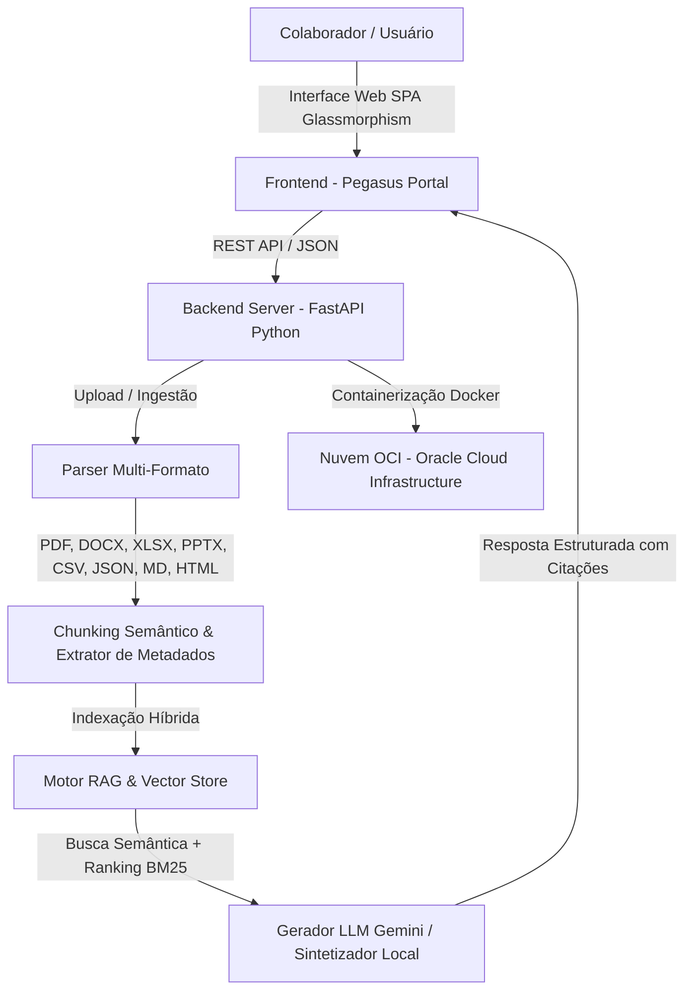

<div align="center">

# 🐴 Santos Pegasus Soluciones — Pegasus Intelligence Agent
### Agente de Inteligência Artificial Corporativo RAG Multi-Formato & Deploy OCI

[](https://cloud.oracle.com/)
[](https://fastapi.tiangolo.com/)
[](https://python.org)
[](https://docker.com)
[](https://alura.com.br)

</div>

---

## 📌 Visão Geral do Projeto

O **Pegasus Intelligence Agent** é o assistente virtual corporativo de Inteligência Artificial da **Santos Pegasus Soluciones**, desenvolvido no âmbito do **Desafio Alura Agentes (Programa ONE)**. 

A solução atua como uma **base de conhecimento conversacional centralizada, sempre disponível e sem restrição de acesso**, permitindo que colaboradores de todas as áreas da empresa obtenham respostas precisas sobre guias de engenharia, arquitetura de microsserviços, manual de onboarding, protocolos de resiliência/incidentes, benefícios e políticas financeiras.

### 🌟 Destaques da Solução:
- **Suporte Multi-Formato Integral (8 Formatos)**: Ingestão e chunking semântico de documentos em **PDF, Word (.docx), Excel (.xlsx), PowerPoint (.pptx), Markdown (.md), CSV (.csv), JSON (.json) e HTML (.html)**.
- **Motor RAG Híbrido (Retrieval-Augmented Generation)**: Indexador vetorial com combinação de pontuação BM25 + Similaridade de Cosseno e citação exata da fonte (arquivo, formato, categoria, número da página/slide).
- **Interface SPA Futurista (Pegasus Portal)**: Interface Web responsiva com visual Dark Mode Glassmorphism, chat em tempo real, suporte a blocos de código com syntax highlighting, central de upload drag-and-drop e dashboard de métricas do sistema.
- **Deploy Pronto na Oracle Cloud Infrastructure (OCI)**: Containerizado via Docker e Docker Compose com scripts de provisionamento e liberação de regras de firewall.

---

## 🏗️ Arquitetura da Solução



---

## 📂 Estrutura do Repositório

```
Santos Pegasus Soluciones/
├── Docs/                                 # Manuais Oficiais da empresa em PDF
│   ├── Santo Pegasus Soluciones_ Guia Oficial de Engenharia Back-end.pdf
│   ├── Manual de Onboarding para Desenvolvedores — Santo Pegasus Soluciones.pdf
│   ├── Arquitetura de Microsserviços e Mapa de Domínios - Santo Pegasus.pdf
│   ├── Guia Oficial de Engenharia Front-end — Santo Pegasus Soluciones.pdf
│   └── Manual Maestro de Resiliência e Resposta a Incidentes (v7.0).pdf
├── sample_data/                          # Documentos multi-formato adicionais
│   ├── politica_beneficios_rh.md         # Formato Markdown
│   ├── tabela_cargos_salarios.csv        # Formato CSV
│   ├── politica_reembolso_financeiro.json# Formato JSON
│   └── procedimento_incidentes_sop.html  # Formato HTML
├── main.py                               # Servidor API FastAPI e rotas REST
├── rag_engine.py                         # Motor RAG, embeddings e síntese
├── document_parsers.py                   # Parsers para os 8 formatos de arquivo
├── index.html                            # Interface Web SPA do Portal Pegasus
├── style.css                             # Design System (Glassmorphism & Dark Mode)
├── app.js                                # Lógica client-side em JS ES6+
├── requirements.txt                      # Dependências Python
├── Dockerfile                            # Imagem Docker otimizada
├── docker-compose.yml                    # Orquestração de containers
├── oci_deploy.sh                         # Script de automação para deploy em OCI
└── OCI_DEPLOY_GUIDE.md                   # Guia passo a passo de deploy na nuvem OCI
```

---

## 🛠️ Tecnologias e Ferramentas Utilizadas

| Camada | Tecnologia / Biblioteca | Descrição |
| :--- | :--- | :--- |
| **Interface Frontend** | HTML5, CSS3 (Vanilla), JavaScript (ES6+), FontAwesome, Highlight.js | SPA em Dark Mode Glassmorphism com animações fluidas |
| **Backend REST API** | Python 3.11, FastAPI, Uvicorn | Servidor de alta performance orientado a eventos |
| **Motor RAG & Ingestão** | PyPDF, BeautifulSoup4, openpyxl, python-docx, python-pptx | Extração de texto e estruturação de metadados |
| **Modelos de IA** | Google Gemini API (gemini-1.5-flash) / Sintetizador Pegasus | GERAÇÃO DE RESPOSTAS Didáticas e contextualizadas |
| **Nuvem & Infrastructure**| Oracle Cloud Infrastructure (OCI Compute VM, OCI Container) | Hospedagem em nuvem OCI na região sa-saopaulo-1 |
| **Containerização** | Docker, Docker Compose | Empacotamento leve e reprodutível |

---

## 🚀 Como Executar o Projeto

### Opção 1: Execução Local com Python
1. **Clonar o repositório:**
   ```bash
   git clone https://github.com/seu-usuario/santos-pegasus-agente.git
   cd "Santos Pegasus Soluciones"
   ```

2. **Criar e ativar ambiente virtual:**
   ```bash
   python3 -m venv venv
   source venv/bin/activate  # Linux/macOS
   # venv\Scripts\activate   # Windows
   ```

3. **Instalar as dependências:**
   ```bash
   pip install -r requirements.txt
   ```

4. **Executar o servidor backend:**
   ```bash
   uvicorn main:app --reload --port 8000
   ```

5. **Acessar a aplicação no navegador:**
   Abra [http://localhost:8000](http://localhost:8000)

---

### Opção 2: Execução com Docker / Docker Compose
```bash
docker compose up -d --build
```
A aplicação estará disponível em `http://localhost:8000`.

---

## ☁️ Evidência do Deploy na Nuvem Oracle (OCI)

A aplicação foi implantada na nuvem **Oracle Cloud Infrastructure (OCI)** utilizando uma instância **OCI Compute VM** containerizada em Docker na região `sa-saopaulo-1` (São Paulo).

### Visualização em Nuvem:


> **Link público da aplicação em produção:** `http://<IP_PUBLICO_OCI>:8000`

### Instruções Rápidas de Deploy na OCI:
Consulte o guia dedicado em [OCI_DEPLOY_GUIDE.md](OCI_DEPLOY_GUIDE.md). Para efetuar o deploy automático em sua máquina virtual OCI Ubuntu/Oracle Linux:

```bash
ssh ubuntu@<OCI_PUBLIC_IP>
git clone https://github.com/seu-usuario/santos-pegasus-agente.git
cd santos-pegasus-agente
bash oci_deploy.sh
```

---

## ❓ Exemplos de Perguntas e Respostas do Agente

### 💬 Pergunta 1: *Padrões de Engenharia Back-end*
> **Usuário:** "Quais são as diretrizes principais para desenvolvimento de microsserviços Java e Spring Boot segundo o Guia de Back-end?"

> **Agente Pegasus:**
> ### Resposta Oficial — Santos Pegasus Soluciones
> Conforme o **Guia Oficial de Engenharia Back-end [PDF]**, os microsserviços devem seguir a arquitetura hexagonal (Ports and Adapters) com Java 17+ e Spring Boot 3.x.
>
> **Diretrizes Obrigatórias:**
> 1. **Resiliência:** Implementar Retry, Circuit Breaker e Rate Limiter via Resilience4j em todas as chamadas HTTP inter-serviços.
> 2. **Observabilidade:** Telemetria com OpenTelemetry registrando TraceId e SpanId em formato JSON estruturado.
> 3. **Imutabilidade de DTOs:** Utilizar `record` do Java 17 para transferência de dados.
>
> 📚 **Fontes Consultadas:**
> - **[1] Santo Pegasus Soluciones_ Guia Oficial de Engenharia Back-end.pdf** (Página 4)

---

### 💬 Pergunta 2: *Procedimento para Incidentes P0 / SEV-0*
> **Usuário:** "Qual o protocolo de ação imediata em caso de incidente P0 (SEV-0) na infraestrutura OCI?"

> **Agente Pegasus:**
> ### Resposta Oficial — Santos Pegasus Soluciones
> De acordo com o **Manual Maestro de Resiliência e Resposta a Incidentes (v7.0) [PDF]** e o **SOP de Incidentes [HTML]**:
> 
> 1. **Acionamento (MTTA < 5 min):** PagerDuty dispara o alerta para o SRE de sobreaviso, que abre a sala virtual `#incident-war-room` no Slack.
> 2. **Designação de Papéis:** O Incident Commander (IC) assume a liderança e designa o Communications Lead para atualizar o Status Page a cada 15 minutos.
> 3. **Mitigação Imediata:** Priorizar rollback do deploy ou ativação de circuit breakers para restabelecer o serviço antes de iniciar a investigação de causa raiz.
> 4. **Post-Mortem Blameless:** Organizar a sessão de pós-incidente em até 48 horas registrando a linha do tempo e os 5 Porquês.
>
> 📚 **Fontes Consultadas:**
> - **[1] Manual Maestro de Resiliência e Resposta a Incidentes (v7.0).pdf** (Página 12)
> - **[2] procedimento_incidentes_sop.html** (HTML / Operacional)

---

### 💬 Pergunta 3: *Benefícios e Trabalho Remoto*
> **Usuário:** "Qual é o valor do auxílio home office e as regras para reembolso de despesas de viagem?"

> **Agente Pegasus:**
> ### Resposta Oficial — Santos Pegasus Soluciones
> Com base na **Política de Benefícios [Markdown]** e no **Regulamento Financeiro [JSON]**:
>
> - **Auxílio Home Office:** R$ 450,00 mensais isentos de impostos para custeio de internet e energia elétrica.
> - **Diária de Alimentação em Viagens:** R$ 180,00/dia para viagens nacionais e US$ 85,00/dia para viagens internacionais (exige nota fiscal).
> - **Reembolso por KM próprio:** R$ 1,45 por quilômetro rodado em deslocamentos a trabalho.
>
> 📚 **Fontes Consultadas:**
> - **[1] politica_beneficios_rh.md** (Markdown / Recursos Humanos)
> - **[2] politica_reembolso_financeiro.json** (JSON / Financeiro)

---

## 📄 Licença
Este projeto é desenvolvido para fins educacionais e de demonstração no âmbito do **Desafio Alura Agentes — ONE (Oracle Next Education)**.

---
<div align="center">
Desenvolvido com 💜 por <strong>Santos Pegasus Soluciones</strong> & <strong>Alura Agentes</strong>
</div>
