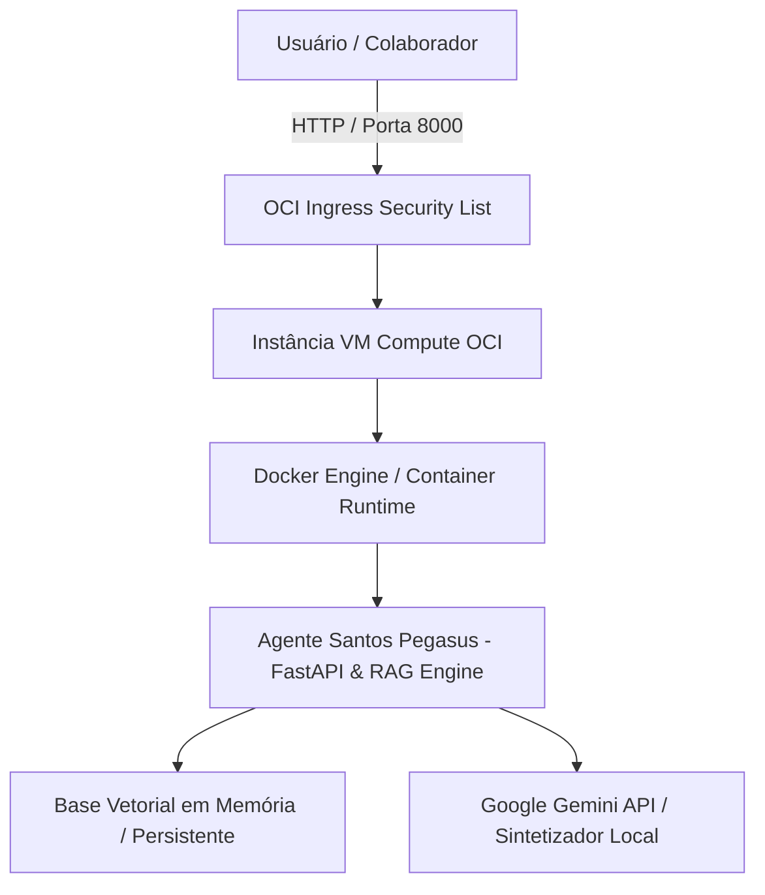

# Guia Oficial de Deploy na Oracle Cloud Infrastructure (OCI)

Este guia documenta o passo a passo completo para realizar o **deploy em nuvem** do **Agente Inteligente Corporativo da Santos Pegasus Soluciones** na **Oracle Cloud Infrastructure (OCI)**.

---

## 1. Arquitetura da Solução na Nuvem OCI



### Recursos OCI Utilizados:
- **Serviço de Compute**: Instância OCI Compute (Ubuntu 22.04 LTS ou Oracle Linux 8.x / 9.x Always Free ou Standard).
- **VCN (Virtual Cloud Network)**: VCN configurada na região `sa-saopaulo-1`.
- **Security List**: Regra de Ingress permitindo tráfego TCP na porta `8000`.

---

## 2. Passo a Passo de Criação da Instância na OCI

### Etapa A: Criar a Instância Compute
1. Acesse o console da Oracle Cloud: [https://cloud.oracle.com/](https://cloud.oracle.com/).
2. No menu lateral, navegue até **Compute** > **Instances**.
3. Clique no botão **Create Instance**.
4. Defina os seguintes parâmetros:
   - **Name**: `santos-pegasus-agent-vm`
   - **Compartment**: Selecione seu compartimento.
   - **Image**: Ubuntu 22.04 LTS ou Oracle Linux 8.x.
   - **Shape**: `VM.Standard.A1.Flex` (Ampere ARM, 4 OCPUs, 24GB RAM - Always Free) ou `VM.Standard2.1` / `VM.Standard.E4.Flex`.
5. Baixe as **Chaves SSH** (SSH Key Pair) para acesso à máquina.
6. Clique em **Create**.

---

### Etapa B: Configurar a Security List da VCN (Liberação da Porta 8000)
1. No console OCI, vá até **Networking** > **Virtual Cloud Networks**.
2. Clique na sua VCN principal e abra a **Default Security List for VCN**.
3. Clique em **Add Ingress Rules**.
4. Preencha os campos:
   - **Source Type**: `CIDR`
   - **Source CIDR**: `0.0.0.0/0`
   - **IP Protocol**: `TCP`
   - **Destination Port Range**: `8000`
   - **Description**: `Permitir acesso web ao Agente Pegasus`
5. Clique em **Add Ingress Rules**.

---

## 3. Conexão SSH e Deploy Automatizado

### 1. Conectar via SSH à VM OCI
```bash
ssh -i /caminho/para/sua_chave.key ubuntu@<OCI_PUBLIC_IP>
```

### 2. Clonar o Repositório do GitHub
```bash
git clone https://github.com/seu-usuario/santos-pegasus-agente.git
cd santos-pegasus-agente
```

### 3. Executar o Script de Deploy Automatizado
```bash
chmod +x oci_deploy.sh
./oci_deploy.sh
```

---

## 4. Evidência de Execução em Nuvem

Após o término da execução do script, acesse o painel no seu navegador:

```
http://<OCI_PUBLIC_IP>:8000
```

### Endpoints Principais de Diagnóstico na OCI:
- **Interface Principal (SPA)**: `http://<OCI_PUBLIC_IP>:8000/`
- **Healthcheck JSON**: `http://<OCI_PUBLIC_IP>:8000/api/health`
- **Documentos Indexados**: `http://<OCI_PUBLIC_IP>:8000/api/documents`
- **Métricas do Sistema**: `http://<OCI_PUBLIC_IP>:8000/api/metrics`

---

## 5. Resolução de Problemas Comuns (Troubleshooting)

- **Porta não responde externamente**:
  No Linux da OCI, além da Security List, execute no terminal da VM:
  ```bash
  sudo iptables -I INPUT -p tcp --dport 8000 -j ACCEPT
  sudo ufw allow 8000/tcp
  ```
- **Ver logs em tempo real**:
  ```bash
  docker compose logs -f
  ```
